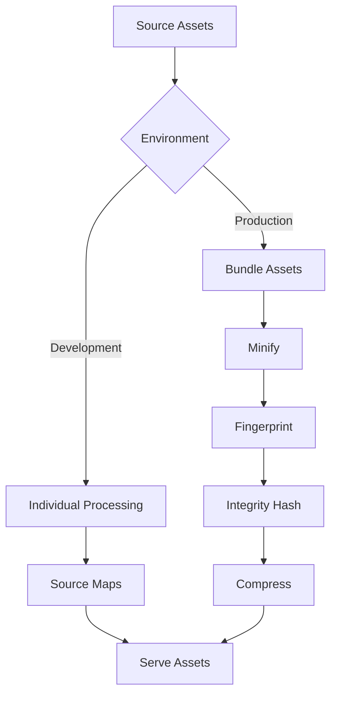

# Asset Processing and Optimization Pipeline

This document describes the comprehensive asset processing and optimization pipeline implemented for the Hugo Overreacted Blog template.

## Overview

The asset processing pipeline provides:

- **CSS minification and fingerprinting** for production builds
- **JavaScript bundling and optimization** with integrity hashes
- **Cache busting mechanisms** for efficient browser caching
- **Asset compression** and performance optimization
- **Security enhancements** with Subresource Integrity (SRI)

## Architecture

### Development vs Production

#### Development Mode
- Individual asset files for better debugging
- Source maps enabled for CSS and JavaScript
- No minification for faster builds
- Live reload support

#### Production Mode
- Asset bundling and concatenation
- Minification of CSS, JavaScript, and HTML
- Fingerprinting for cache busting
- Integrity hashes for security
- Compression (gzip) support

### Asset Processing Flow



## Configuration

### Hugo Configuration (hugo.toml)

The asset processing pipeline is configured through several sections:

#### Build Configuration
```toml
[build]
  writeStats = true
  
  [build.buildStats]
    enable = true
    disableClasses = false
    disableIDs = false
    disableTags = false
  
  # Cache busters for comprehensive asset optimization
  [[build.cachebusters]]
    source = "hugo_stats\\.json"
    target = "css"
  
  [[build.cachebusters]]
    source = "assets/css/.*\\.css"
    target = "css"
  
  [[build.cachebusters]]
    source = "assets/js/.*\\.(js|ts)"
    target = "js"
```

#### Minification Settings
```toml
[minify]
  disableCSS = false
  disableHTML = false
  disableJS = false
  
  [minify.tdewolff]
    [minify.tdewolff.css]
      keepCSS2 = true
      precision = 0
    [minify.tdewolff.js]
      keepVarNames = false
      precision = 0
```

#### Cache Configuration
```toml
[caches]
  [caches.assets]
    dir = ":resourceDir/_gen"
    maxAge = "1h"
  [caches.images]
    dir = ":resourceDir/_gen"
    maxAge = "24h"
```

### PostCSS Configuration

Enhanced CSS processing with autoprefixer and optimization:

```javascript
module.exports = {
  plugins: [
    require('autoprefixer')({
      overrideBrowserslist: ['> 1%', 'last 2 versions']
    }),
    ...(process.env.HUGO_ENVIRONMENT === 'production' ? [
      require('cssnano')({
        preset: 'default'
      })
    ] : [])
  ]
};
```

## Asset Processing Components

### CSS Processing (`layouts/_partials/css.html`)

Features:
- Tailwind CSS v4.1 integration with CSS-first configuration
- Conditional minification based on environment
- Fingerprinting with SHA-256 hashes
- Preload directives for critical CSS
- Integrity attributes for security

Example output (production):
```html
<link rel="preload" href="/css/main.a1b2c3d4.css" as="style" 
      onload="this.onload=null;this.rel='stylesheet'" 
      integrity="sha256-..." crossorigin="anonymous">
```

### JavaScript Processing (`layouts/_partials/scripts.html`)

Features:
- Asset bundling for production
- ES2018 target compilation
- Tree shaking and dead code elimination
- Source map generation (development)
- Integrity hashes and CORS headers

Example output (production):
```html
<script src="/js/main.e5f6g7h8.js" 
        integrity="sha256-..." 
        crossorigin="anonymous" defer></script>
```

### Asset Optimization Partial (`layouts/_partials/asset-optimization.html`)

Reusable component for:
- Dynamic asset bundling
- Environment-specific processing
- Resource hints generation
- Performance optimization

Usage:
```go
{{ partial "asset-optimization.html" (dict 
  "type" "js" 
  "assets" $jsAssets 
  "bundle" "main.js" 
  "defer" true
) }}
```

## Build Scripts

### Main Build Script (`scripts/build-assets.sh`)

Comprehensive build automation with:
- Dependency validation
- Asset generation
- Build optimization
- Statistics reporting
- Validation checks

Usage:
```bash
# Development build
HUGO_ENV=development ./scripts/build-assets.sh

# Production build
HUGO_ENV=production ./scripts/build-assets.sh

# With validation
./scripts/build-assets.sh --validate
```

### NPM Scripts

Convenient build commands:
```bash
npm run build              # Standard build
npm run build:production   # Production build
npm run build:development  # Development build
npm run dev               # Development server
npm run validate          # Build with validation
npm run optimize          # Full optimization
```

## Performance Optimizations

### Cache Busting

Multiple cache busting strategies:
1. **File fingerprinting** - SHA-256 hashes in filenames
2. **Cache headers** - Appropriate cache control directives
3. **Resource versioning** - Automatic version bumping
4. **Dependency tracking** - Smart cache invalidation

### Asset Compression

- **Gzip compression** for text assets
- **Brotli support** (when available)
- **Image optimization** through Hugo's image processing
- **SVG minification** via PostCSS plugins

### Resource Hints

Performance enhancements:
- `dns-prefetch` for external resources
- `preload` for critical assets
- `prefetch` for next-page resources
- `preconnect` for third-party domains

## Security Features

### Subresource Integrity (SRI)

All assets include integrity hashes:
```html
<link rel="stylesheet" href="/css/main.abc123.css" 
      integrity="sha256-..." crossorigin="anonymous">
```

### Content Security Policy (CSP)

Asset processing supports CSP headers:
- Nonce generation for inline scripts
- Hash-based CSP for inline styles
- Strict asset loading policies

### Cross-Origin Resource Sharing (CORS)

Proper CORS headers for:
- Cross-domain asset loading
- CDN compatibility
- Third-party integrations

## Monitoring and Analytics

### Build Statistics

Generated asset manifest includes:
- File sizes and counts
- Compression ratios
- Build timestamps
- Environment information

### Performance Metrics

Tracking for:
- Build time optimization
- Asset size monitoring
- Cache hit rates
- Loading performance

## Troubleshooting

### Common Issues

1. **Build failures**
   - Check Hugo version (minimum 0.148.1)
   - Verify Node.js dependencies
   - Review asset paths

2. **Asset not found**
   - Verify file paths in `assets/` directory
   - Check module mounts configuration
   - Review cache busting rules

3. **Integrity hash mismatches**
   - Clear Hugo cache: `hugo --gc`
   - Rebuild assets: `npm run clean && npm run build`
   - Check for concurrent builds

### Debug Mode

Enable verbose logging:
```bash
HUGO_ENV=development hugo --verbose --debug
```

### Cache Management

Clear caches:
```bash
# Clear Hugo caches
hugo --gc

# Clear Node.js caches
npm run clean

# Clear all caches
rm -rf resources/_gen tmp/hugo_cache node_modules/.cache
```

## Best Practices

### Development Workflow

1. Use development mode for active development
2. Test production builds before deployment
3. Validate assets with `npm run validate`
4. Monitor build performance

### Production Deployment

1. Always use production environment
2. Enable all optimizations
3. Verify integrity hashes
4. Test asset loading

### Performance Monitoring

1. Monitor asset sizes
2. Track build times
3. Measure loading performance
4. Optimize based on metrics

## Future Enhancements

Planned improvements:
- HTTP/2 push support
- Advanced image optimization
- Service worker integration
- Progressive web app features
- Advanced caching strategies

## Requirements Compliance

This implementation satisfies:
- **Requirement 8.3**: CSS minification and fingerprinting for production
- **Requirement 8.4**: JavaScript bundling and optimization
- **Requirement 8.5**: Integrity hashes for security and asset caching mechanisms